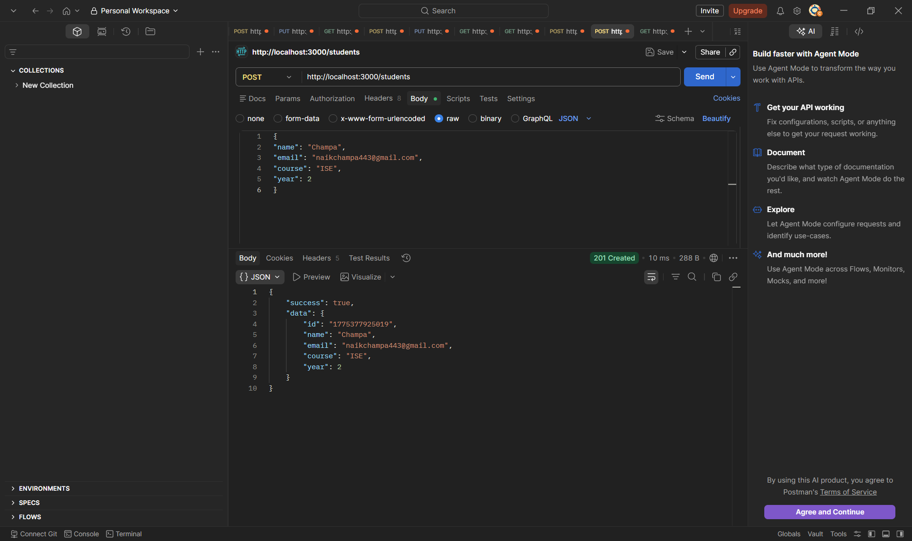
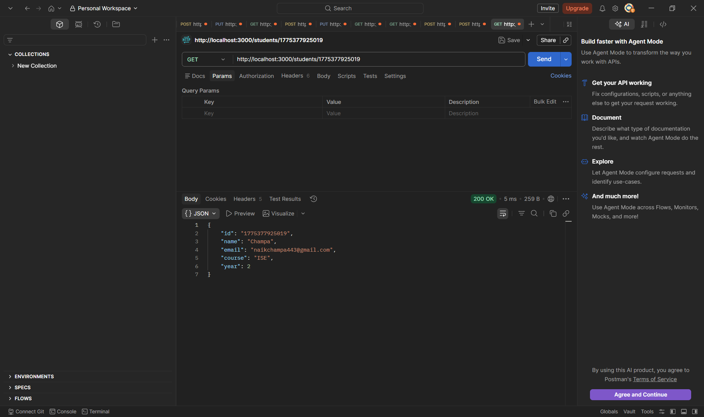
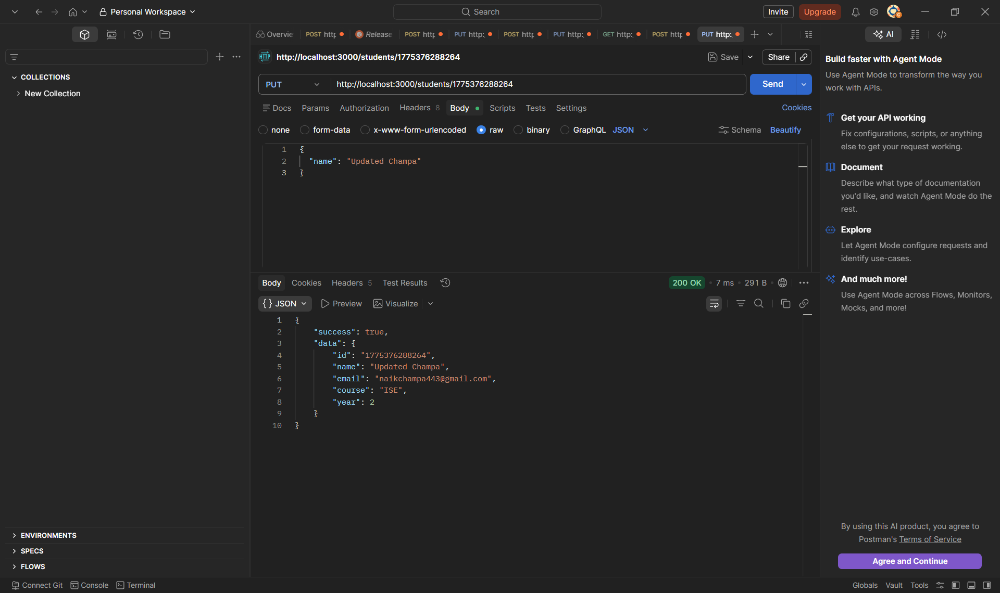
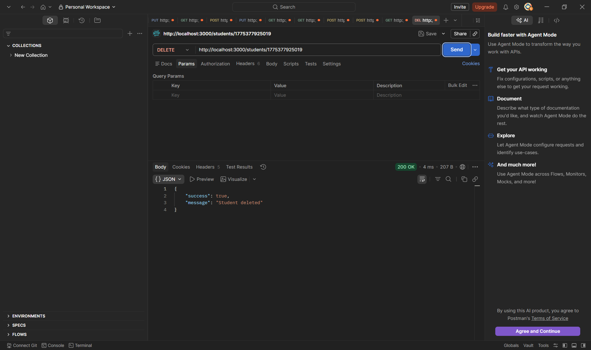

# College Student Management REST API

This project is built using Node.js HTTP module without external frameworks.

## Features

- POST /students
- GET /students
- GET /students/:id
- PUT /students/:id
- DELETE /students/:id

## Screenshots

### POST

### GET

### PUT

### DELETE

## Tech Used

- Node.js
- HTTP Module
- Postman

## Author

Champa Naik
